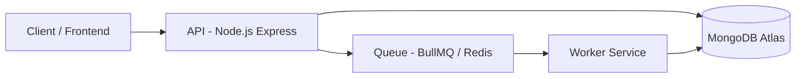
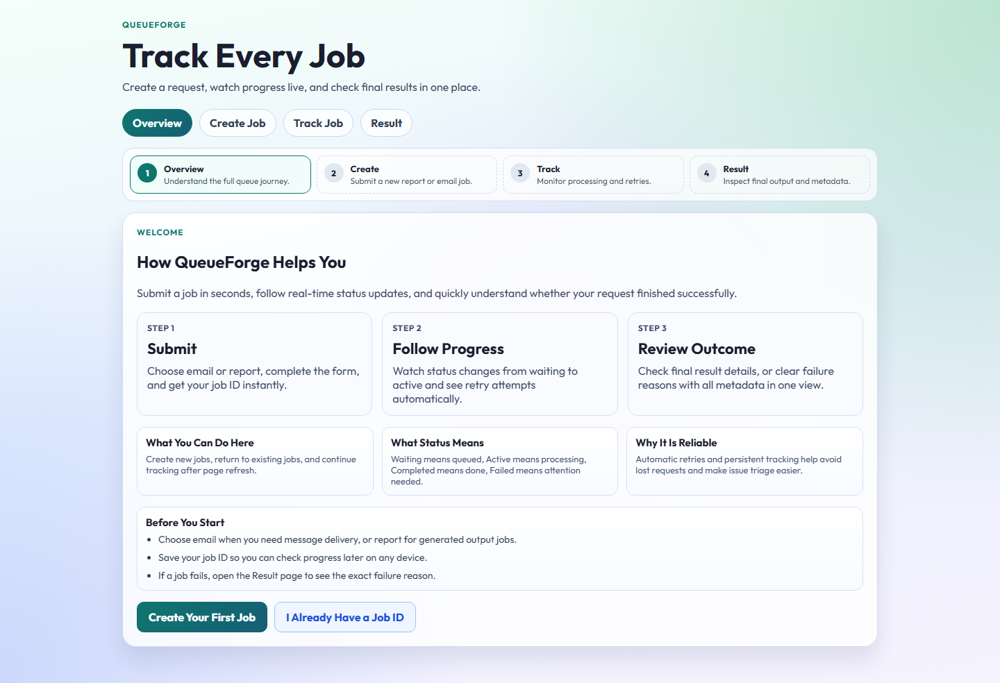
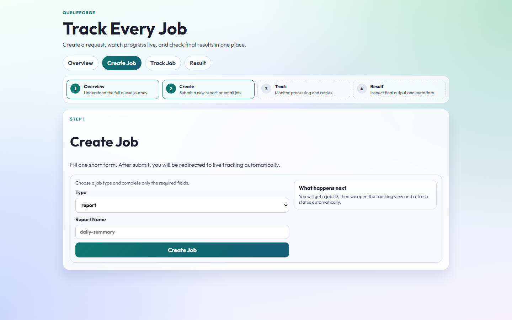
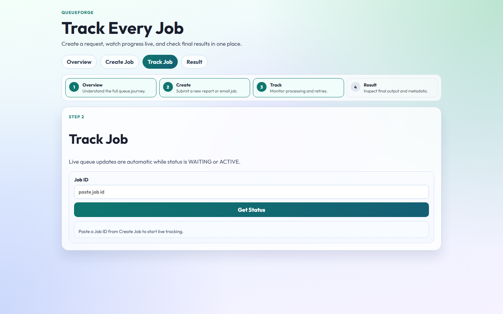
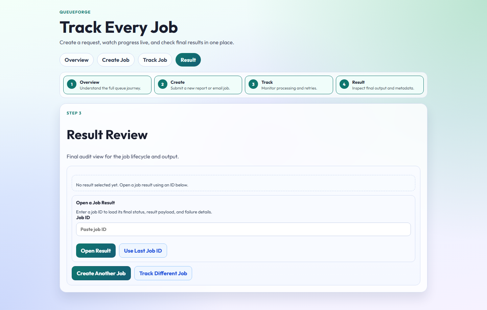

# QueueForge - Distributed Job Processing System

A production-style asynchronous job processing system built with Node.js, BullMQ, Redis, and MongoDB, supporting retries, failure handling, and distributed workers.

## Features

- Asynchronous job processing using Redis-backed queues (BullMQ)
- Distributed worker architecture (separate API and worker services)
- Retry mechanism with exponential backoff
- Failure classification (retryable vs permanent errors)
- Persistent job lifecycle tracking (MongoDB as source of truth)
- Real-time job status tracking via API
- Real report processing workload (row profiling + checksum generation)
- Rate limiting to protect API behavior under burst traffic
- Dockerized multi-service deployment
- Production-ready environment configuration

## Architecture

Client -> API -> Queue (Redis) -> Worker -> MongoDB

- API handles job creation and status queries
- Jobs are pushed to Redis queue (BullMQ)
- Worker processes jobs asynchronously
- MongoDB stores job lifecycle and results



## Tech Stack

- Backend: Node.js, Express
- Queue: BullMQ, Redis
- Database: MongoDB (Atlas)
- Frontend: React (Vite)
- Infrastructure: Docker, Docker Compose
- Deployment: AWS EC2

## Project Structure

```text
backend/
frontend/
docker-compose.yml
```

## Job Lifecycle

WAITING -> ACTIVE -> COMPLETED / FAILED

- WAITING: Job is queued
- ACTIVE: Job is being processed
- COMPLETED: Job finished successfully
- FAILED: Job failed after retries or due to permanent error

## Retry & Failure Handling

- Exponential backoff retry strategy
- Configurable retry attempts
- Failure classification:
  - Retryable errors -> retried
  - Permanent errors -> fail immediately
- Terminal failure states:
  - MAX_RETRIES_REACHED
  - PERMANENT_ERROR

## Run with Docker

```bash
git clone https://github.com/ManasBhardwaj07/Queueforge.git
cd Queueforge
docker-compose up --build
```

Note: `docker compose` (v2) is preferred when available.

MongoDB deployment mode:
- Production/demo deployment uses MongoDB Atlas via `MONGO_URI`.
- The `mongo` service in `docker-compose.yml` is intended for local development fallback only.

## Concurrency Validation

Live burst test (April 2026, EC2 deployment):
- Submitted: 10 report jobs back-to-back
- Terminal states reached: 10/10
- Completed: 10
- Failed: 0
- Total time to terminal states: 19 seconds

Observed behavior under burst traffic:
- API accepts jobs immediately and returns `WAITING`.
- Worker transitions jobs through `ACTIVE` to terminal state.
- Retryable failures (when simulated) re-enter `WAITING` with backoff and preserve attempt counters.
- Terminal failures persist `finalFailureReason` for postmortem analysis.

This demonstrates queue-driven decoupling and stable behavior under short traffic spikes.

## Live Demo

Frontend: http://<your-ec2-ip>:3001  
API: http://<your-ec2-ip>:5000/health

Current deployment example:  
Frontend: http://13.60.71.27:3001  
API: http://13.60.71.27:5000/health

## UI Screenshots

### Overview


### Create Job


### Track Job


### Result Review


## Environment Variables

```env
MONGO_URI=
REDIS_HOST=
PORT=
```

## Why This Project

This project demonstrates real backend system design concepts:

- Asynchronous processing
- Queue-based architecture
- Fault tolerance and retries
- Separation of concerns (API vs worker)
- Production deployment using Docker and AWS
